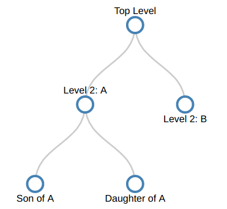
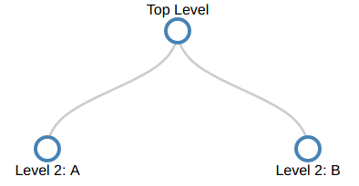
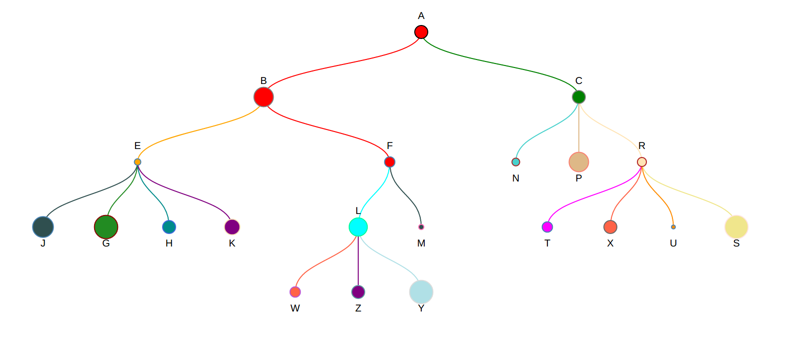

# Tree Folder D3

##Yêu cầu 
Thể hiện cây thư mục với thành phần là các nút cha - con tượng trưng với D3js. 
Dữ liệu đầu vào là file json chứa thông tin các cấp thư mục

##Thực hiện 
###Bước 1: Vẽ cây thư mục dạng tĩnh bằng tree layout d3js
Dữ liệu: 

```
var treeData = [
        {
            "name": "Top Level",
            "parent": "null",
            "children": [
                {
                    "name": "Level 2: A",
                    "parent": "Top Level",
                    "children": [
                        {
                            "name": "Son of A",
                            "parent": "Level 2: A"
                        },
                        {
                            "name": "Daughter of A",
                            "parent": "Level 2: A"
                        }
                    ]
                },
                {
                    "name": "Level 2: B",
                    "parent": "Top Level"
                }
            ]
        }
    ];

```
Khởi tạo các biến ban đầu 

``` 
var margin = {top: 40, right: 120, bottom: 20, left: 120},
        width = 960 - margin.right - margin.left,
        height = 500 - margin.top - margin.bottom;

    var i = 0;
    // Create tree layout, the line connecting 2 node, svg to draw
    var tree = d3.layout.tree()
        .size([height, width]);
    var diagonal = d3.svg.diagonal()
        .projection(function(d) { return [d.x, d.y]; });
    var svg = d3.select("body").append("svg")
        .attr("width", width + margin.right + margin.left)
        .attr("height", height + margin.top + margin.bottom)
        .append("g")
        .attr("transform", "translate(" + margin.left + "," + margin.top + ")");
    root = treeData[0];
```

Hàm Vẽ cây thư mục:

- Tạo biến thể hiện nút và đường kẻ
``` 
function update(source) {
        // Compute the new tree layout.
        var nodes = tree.nodes(root).reverse(),
            links = tree.links(nodes);
        ...
    }
```

- Độ cao chung của cây thư mục (bao gồm các cây thư mục con): 
```  
nodes.forEach(function(d) { d.y = d.depth * 100; });
```

- Thêm các hình tròn đại diện thư mục và chữ thể hiện tên: 
``` 
 var nodeEnter = node.enter().append("g")
            .attr("class", "node")
            .attr("transform", function(d) {
                return "translate(" + d.x + "," + d.y + ")"; });
        nodeEnter.append("circle")
            .attr("r", 10)
            .style("fill", "#fff");
        nodeEnter.append("text")
            .attr("y", function(d) {
                return d.children || d._children ? -18 : 18; })
            .attr("dy", ".35em")
            .attr("text-anchor", "middle")
            .text(function(d) { return d.name; })
            .style("fill-opacity", 1);
```

- Thêm đường kẻ nối các thư mục với nhau: 

``` 
var link = svg.selectAll("path.link")
            .data(links, function(d) { return d.target.id; });
        // Enter the links.
        link.enter().insert("path", "g")
            .attr("class", "link")
            .attr("d", diagonal);
```
Kết quả 



###Bước 2: Chuyển dữ liệu sang file json và Cây thư mục sang dạng động 

Hàm đọc file json: 
``` 
d3.json("color.json", function (error, flare) {
        if (error) throw error;

        root = flare;
        root.x0 = height / 2;
        root.y0 = 0;

        function collapse(d) {
            if (d.children) {
                d._children = d.children;
                d._children.forEach(collapse);
                d.children = null;
            }
        }

```
Thêm sự kiện cho mỗi nút 
``` 
 var nodeEnter = node.enter().append("g")
            .attr("class", "node")
            .attr("transform", function (d) {
                return "translate(" + source.y0 + "," + source.x0 + ")";
            })
            .on("click", click);
``` 

``` 

```
Thêm các hàm update vị trí mới cho cây thư mục (gồm nốt, đường nối, chữ...)

``` 
        var nodeUpdate = node.transition()
            .duration(duration)
            .attr("transform", function (d) {
                return "translate(" + d.x + "," + d.y + ")";
            });
 
        nodeUpdate.select("circle")
            .style("fill", function (d) {
                return d._children ? "lightsteelblue";
            })
 
        nodeUpdate.select("text")
            .style("fill-opacity", 1);
 
        var nodeExit = node.exit().transition()
            .duration(duration)
            .attr("transform", function (d) {
                return "translate(" + source.y + "," + source.x + ")";
            })
            .remove();
 
        nodeExit.select("circle")
            .attr("r", 10);

        nodeExit.select("text")
            .style("fill-opacity", 10);

```
``` 
        link.enter().insert("path", "g")
            .attr("class", "link")
            .style("stroke", "lightsteelblue")
            .attr("d", function (d) {
                var o = {x: source.x0, y: source.y0};
                return diagonal({source: o, target: o});
            });

        
        link.transition()
            .duration(duration)
            .attr("d", diagonal);

        
        link.exit().transition()
            .duration(duration)
            .attr("d", function (d) {
                var o = {x: source.x, y: source.y};
                return diagonal({source: o, target: o});
            })
            .remove();
```
Kết quả:


Bước 3: Hoàn thiện 

Thêm các thuộc tính màu sắc, độ lớn cho nút ở dữ liệu json:
``` 
{
  "name": "A",
  "parent": "null",
  "value": 10,
  "type": "black",
  "level": "red",
  "children": [
    {
      "name": "B",
      "parent": "A",
      "value": 15,
      "type": "grey",
      "level": "red",
      "children": [
        {
          "name": "E",
          "parent": "B",
          "value": 5,
          "type": "steelblue",
          "level": "orange",
          "children": [
            {"name": "J","parent": "E","value": 16,"type": "steelblue","level": "DarkSlateGray"},
            {"name": "G","parent": "E","value": 18,"type": "DarkRed","level": "ForestGreen"},
            {"name": "H","parent": "E","value": 10,"type": "RoyalBlue","level": "DarkCyan"},
            {"name": "K","parent": "E","value": 12,"type": "Wheat","level": "Purple"}
          ]....
```
Thêm code để dọc dữ liệu mới 
``` 
    link.enter().insert("path", "g")
        .style("stroke", function(d) { return d.target.level; })...
        
    nodeEnter.append("circle")
        .attr("r", function(d) { return d.value; })
        .style("stroke", function(d) { return d.type; })
        .style("fill", function(d) { return d.level; });
            
    nodeEnter.append("text")
        .text(function (d) {return d.name;})
    
    nodeUpdate.select("circle")
        .style("fill", function (d) {return d._children ? "lightsteelblue" : d.level;})
        .attr("r", function(d) { return d.value; })
        .style("stroke", function(d) { return d.type; })
        
    link.enter().insert("path", "g")
        .style("stroke", function(d) { return d.target.level; })....
```

##Kết quả

